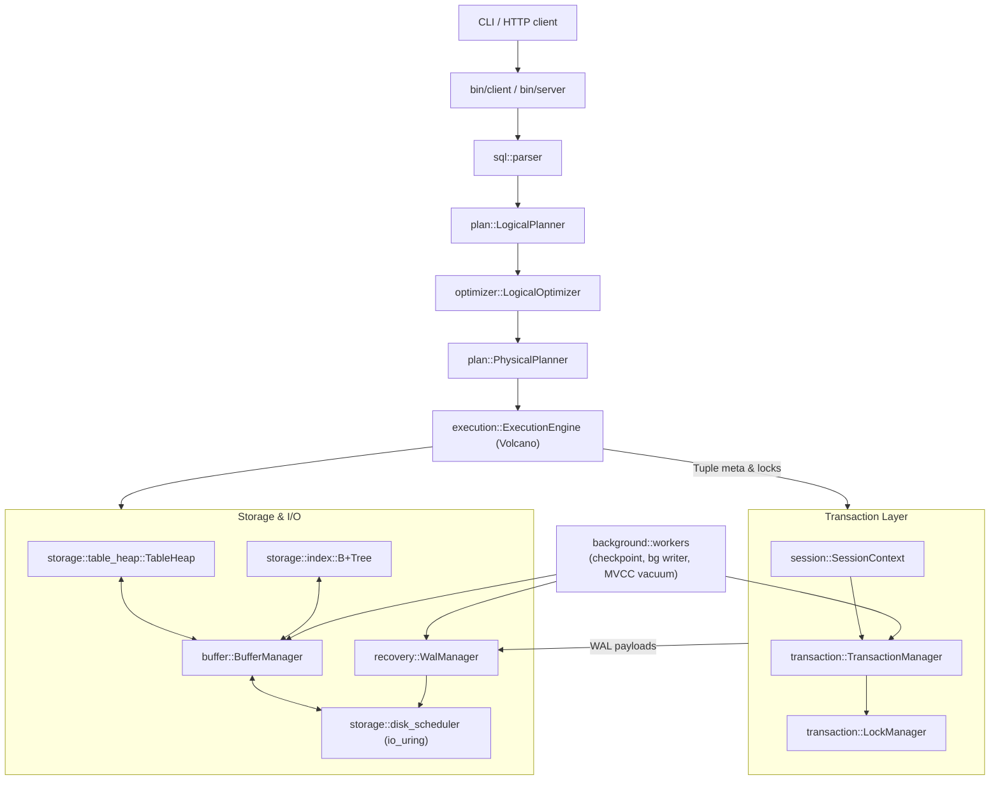
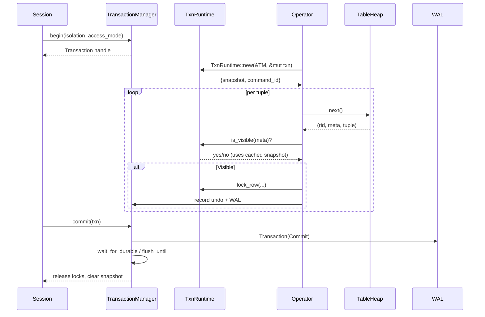

# QuillSQL Architecture

This document explains how a SQL request flows through QuillSQL, how transactional MVCC and background services plug in, and how the main modules collaborate. All diagrams use Mermaid so you can paste them into any compatible renderer for a richer view.

---

## 1. End-to-End Request Pipeline



**High-level flow**
1. SQL text is parsed into an AST, planned into a `LogicalPlan`, optimized by a handful of safe rewrite rules, then lowered into a physical operator tree.
2. `SessionContext` either reuses or creates a transaction and injects isolation/access modes.
3. Each physical operator is driven by the Volcano pull model (`init`/`next`). On entry it obtains a `TxnRuntime` which supplies a command id plus an MVCC snapshot consistent with the transaction’s isolation level.
4. Operators consult the snapshot for tuple visibility, acquire table/row locks through `TxnRuntime`, and issue heap/index operations.
5. DML operators register undo records and append WAL entries via the transaction manager. When the user commits, the manager emits `Commit` records, waits for durability as configured, and releases locks.

---

## 2. Transaction & MVCC Mechanics



- **Snapshots**  
  - *Read Committed / Read Uncommitted:* Every command refreshes its snapshot and clears any cached value on the transaction handle.  
  - *Repeatable Read / Serializable:* The first command captures a snapshot (`xmin`, `xmax`, `active_txns`) and stores it inside `Transaction`. Subsequent commands reuse it, ensuring consistent reads.  
  - Background MVCC vacuum consults `TransactionManager::oldest_active_txn()` to compute `safe_xmin` and prunes tuple versions whose inserting/deleting transactions precede that boundary.

- **Locking**  
  Multi-granularity 2PL (IS/IX/S/SIX/X) enforced by `LockManager`. Repeatable Read releases shared locks at the end of each command (after verifying visibility). Serializable keeps shared locks through commit. Deadlocks are detected via a wait-for graph; a victim simply fails its lock request.

- **Undo & WAL**  
  `Transaction` maintains logical undo entries. On abort, the manager emits CLR records and performs the inverse heap operations. Commit waits depend on `synchronous_commit`. Buffer frames retain their `page_lsn` so WAL-before-data holds.

- **Executor safeguards**  
  `PhysicalUpdate` now skips tuple versions created by the same `(txn_id, command_id)` during the current command. This prevents re-processing the freshly inserted MVCC version and thereby avoids infinite loops.

---

## 3. Storage & Buffering

| Component | Highlights |
| --------- | ---------- |
| `TableHeap` | Tuple metadata (`TupleMeta`) stores inserting/deleting txn ids, command ids, and forward/back pointers for version chains. Helpers like `mvcc_update` stitch new versions while marking old ones deleted. |
| `B+Tree` | B-link tree implementation with separate codecs for header/internal/leaf pages. Index maintenance occurs in DML operators after the heap change succeeds. |
| `BufferManager` | Combines a page table, LRU-K replacer (with TinyLFU admission option), and per-frame guards. Dirty pages record their first-dirty LSN, feeding checkpoints. The background writer periodically flushes dirty frames and drives lazy index cleanup. |
| `DiskScheduler` | Uses io_uring worker threads. Foreground tasks push `ReadPage`, `WritePage`, `WriteWal`, and `FsyncWal` commands through lock-free queues and receive completion on dedicated channels. |

---

## 4. Write-Ahead Logging & Recovery

- `WalManager` manages log sequence numbers, buffers frames, writes physical (`PageWrite`, `PageDelta`) and logical (`HeapInsert/Update/Delete`) records, and coordinates flushes. First-page-writes guard against torn pages.
- `background::spawn_checkpoint_worker` emits `Checkpoint` records capturing the dirty page table and active transactions so recovery can cut replay short.
- `RecoveryManager` executes ARIES-style **analysis → redo → undo** on restart, leveraging CLRs to keep undo idempotent.
- WAL and data I/O both use the `DiskScheduler`, keeping durability guarantees in one place.

---

## 5. Background Services

| Worker | Description | Trigger |
| ------ | ----------- | ------- |
| WAL writer | Coalesces buffered WAL into durable segments | `WalManager::start_background_flush` |
| Checkpoint | Flushes LSNs, records ATT + DPT snapshots, resets FPW epoch | Configurable interval (`WalOptions::checkpoint_interval_ms`) |
| Buffer writer | Flushes dirty frames, runs index lazy cleanup based on pending garbage counters | `IndexVacuumConfig` |
| MVCC vacuum | Iterates table heaps, removing committed-deleted or aborted-inserted tuples older than `safe_xmin` | `MvccVacuumConfig` (interval + batch limit) |

All workers are registered with `background::BackgroundWorkers`, which stops and joins them on database shutdown.

---

## 6. Example Timeline: Repeatable Read UPDATE

```
T1 (RR)                               T2 (RC)
-----------                           -----------
BEGIN;                                BEGIN;
SELECT ... (snapshot S0)              UPDATE row -> new version V1
                                      COMMIT (WAL + flush)
SELECT again -> sees original value
COMMIT
-- background vacuum later reclaims deleted version when safe_xmin > delete_txn
```

- T1’s `TxnRuntime` caches snapshot S0 on its first command and reuses it, so the second `SELECT` filters out V1 even though T2 committed.  
- Row-level shared locks acquired during the read are released at the end of the command, while the MVCC snapshot keeps the view consistent.  
- When T1 commits, locks are dropped, snapshot cache is cleared, and WAL commit record becomes durable. Vacuum eventually removes T1’s deleted predecessor when all transactions with `txn_id < safe_xmin` have finished.

---

## 7. Observability & Configuration

- Enable tracing via `RUST_LOG=trace` to inspect lock grant/queue events and MVCC vacuum activity.
- Key knobs exposed through CLI/environment: WAL segment size, background intervals, default isolation level, MVCC vacuum batch size.
- `background::BackgroundWorkers::snapshot()` reports active worker metadata; you can surface it for debugging endpoints.

---

## 8. Roadmap

- Predicate locking / SSI to upgrade Serializable beyond strict 2PL.
- Cost-based optimization with catalog statistics.
- Smarter vacuum pacing tied to storage pressure and tuple churn.
- Parallel execution and adaptive readahead hints based on operator feedback.

Even with these future items, the current layering mirrors production databases (e.g., PostgreSQL): MVCC + 2PL, ARIES-style WAL, asynchronous maintenance, and a modular Volcano executor—all while keeping the codebase approachable for teaching and experimentation.
