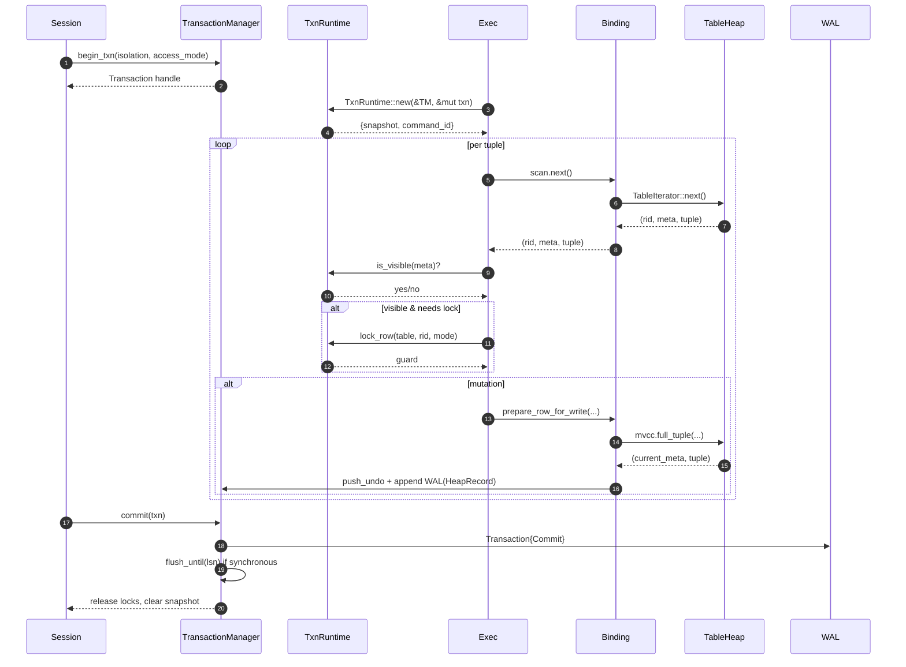
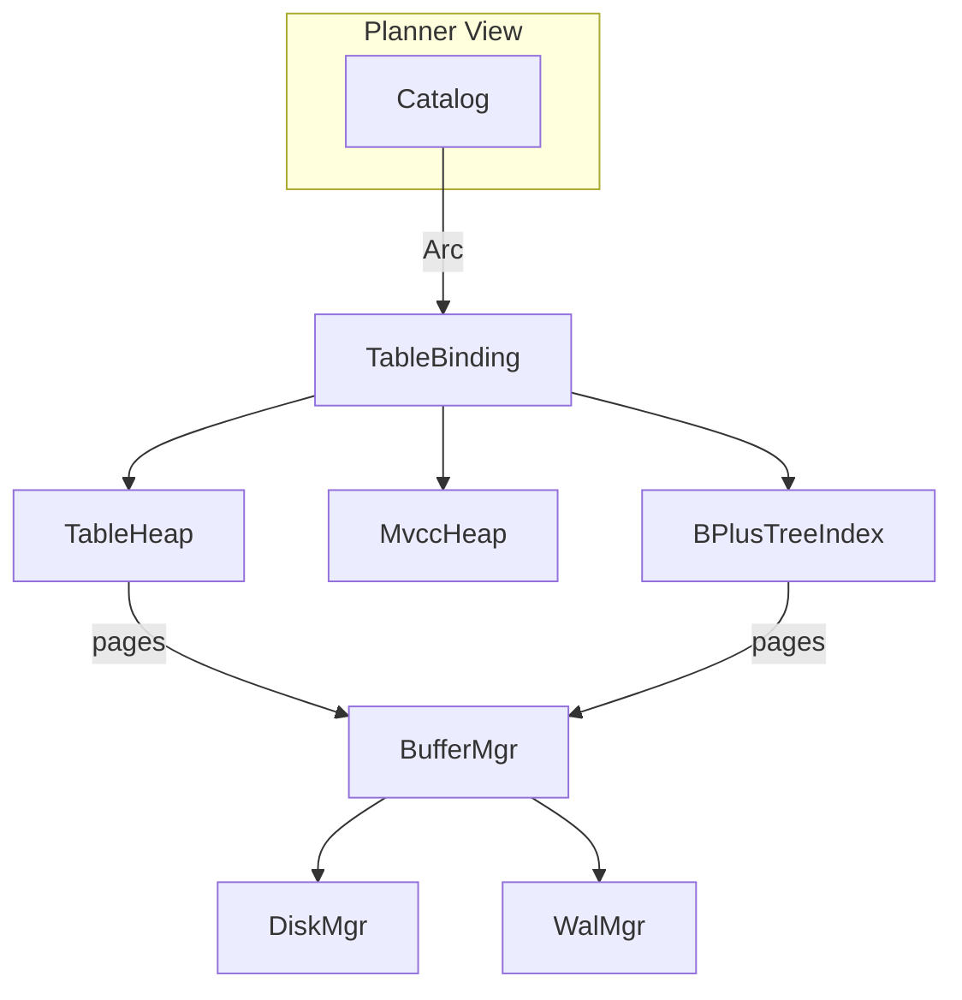
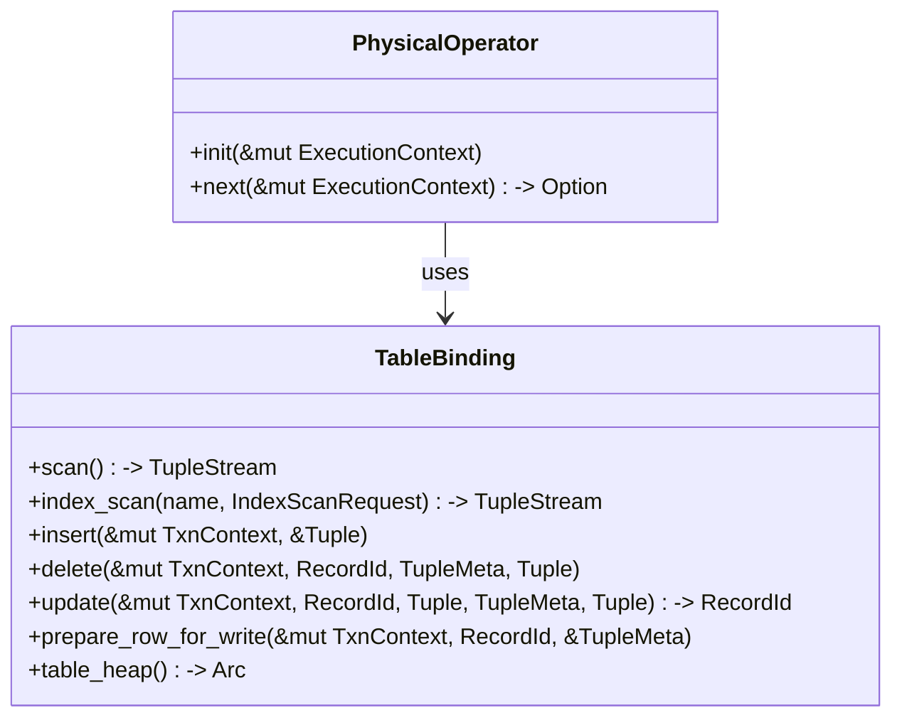
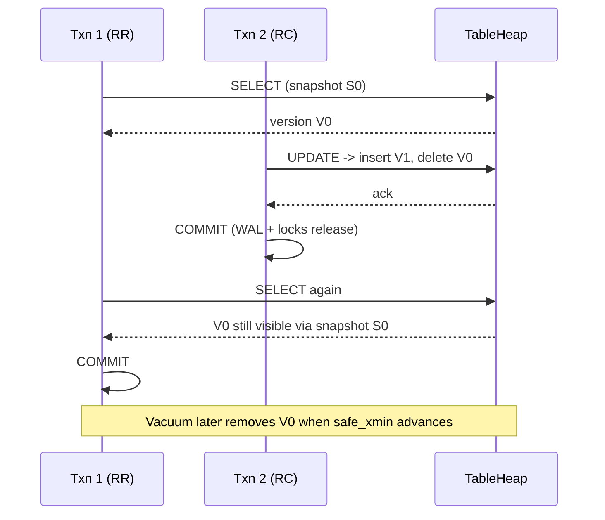

# QuillSQL Architecture

This chapter gives a tour of the major subsystems, the flow of a SQL statement, and the contract between execution, transactions, and storage. It uses Mermaid diagrams so you can render the visuals directly inside mdBook or any compatible viewer.

---

## 1. End-to-End Pipeline

```mermaid
flowchart LR
    subgraph Frontend
        CLI["bin/client"] --> Parser["sql::parser"]
        HTTP["bin/server"] --> Parser
    end
    Parser --> LPlan["plan::LogicalPlanner"]
    LPlan --> Optimizer["optimizer::LogicalOptimizer"]
    Optimizer --> PPlan["plan::PhysicalPlanner"]
    PPlan --> Exec["execution::ExecutionEngine (Volcano)"]

    subgraph Txn["transaction::*"]
        Session["session::SessionContext"]
        TM["TransactionManager"]
        LM["LockManager"]
        Session --> TM --> LM
    end

    Exec <-->|snapshot, locks| Txn
    Exec --> Binding

    subgraph Storage["storage::* & buffer::*"]
        Binding["storage::engine::TableBinding"]
        Heap["storage::table_heap::TableHeap"]
        MVCC["storage::heap::MvccHeap"]
        Index["storage::index::BPlusTree"]
        Buffer["buffer::BufferManager"]
        Disk["storage::disk_scheduler (io_uring)"]
        WAL["recovery::WalManager"]
        Binding --> Heap
        Binding --> Index
        Heap <--> Buffer
        Index <--> Buffer
        Buffer <--> Disk
        WAL --> Disk
    end

    Background["background::workers\n(checkpoint, WAL writer, MVCC vacuum)"] --> {Buffer, WAL, TM}
```

**Key takeaways**
- The frontend (CLI/HTTP) only knows how to parse SQL and drive the planning stages; all shared state lives below.
- The `ExecutionEngine` drives a Volcano iterator. Each physical operator calls into the transaction runtime for visibility checks and locking, but touches storage exclusively through a `TableBinding`. This makes the executor easy to reason about in a classroom setting.
- Buffering, WAL, and disk I/O are centralized so that durability/ordering guarantees stay in one module.

---

## 2. Transactions, MVCC, and the Executor



**Snapshot policy**
- `Read Uncommitted / Read Committed`: every command obtains a fresh snapshot, so repeated statements can see committed updates.
- `Repeatable Read / Serializable`: cache the first snapshot on the `Transaction` handle; subsequent commands reuse it for consistent reads. The lock manager releases S-locks at the end of each command for RR, but Serializable keeps them until commit.

**Undo & WAL**
- Each mutation produces a logical `HeapRecordPayload` or `IndexRecordPayload`. The heap payload already carries redo (new bytes) and undo (old bytes), so recovery can replay forward or backward without re-reading heap pages.
- On abort, the manager walks the undo stack, emits CLRs, and re-applies the inverse heap/index operations.

---

## 3. Storage Layering



| Layer | Responsibility | Notes |
| ----- | -------------- | ----- |
| `TableHeap` | Physical slotted pages, tuple encoding, WAL page image helpers | Exposes insert/update/delete that emit heap-specific WAL payloads before dirtying frames. |
| `MvccHeap` | Version chain management, delete-marking, undo metadata | Creates new versions, rewires forward/back pointers, and delegates actual I/O to `TableHeap`. |
| `TableBinding` | Safe façade for the executor | Provides `scan`, `index_scan`, `insert`, `delete`, `update`, and `prepare_row_for_write`, always pairing heap/index changes so operators stay small. |
| `BufferManager` + `DiskScheduler` | Unified cache + async I/O | Uses LRU-K (+ optional TinyLFU admission) and io_uring to keep the hot set resident. |
| `WalManager` | ARIES-compatible log | Supports logical heap/index records, page write/delta fallback, CLRs, checkpoints, and background flush threads. |

---

## 4. `TableBinding` Contract



This binding hides every MVCC/WAL detail from the operators:
- No more ad-hoc `catalog.table_indexes()` calls.
- No direct references to `MvccHeap` or `TableHeap`.
- Executor code reads like pseudo SQL: “lock table”, “scan binding”, “update tuple”.

---

## 5. WAL & Recovery Details

```mermaid
flowchart LR
    subgraph WAL Record Types
        HI["HeapInsert"] --> redo
        HD["HeapDelete"] --> redo & undo
        PI["PageImage"]
        PD["PageDelta"]
        CI["Checkpoint"]
        CL["CLR"]
    end
    Exec -->|Heap/Index payloads| WalMgr
    BufferMgr -->|needs FPW| WalMgr
    WalMgr --> DiskScheduler --> log files
    Recovery -->|analysis/redone/undo| BufferMgr
```

- **Logical logging first**: heap/index mutations emit redo + undo at the logical level. This keeps the WAL stream compact and human-readable for teaching.
- **Physical fallbacks**: metadata-heavy pages (meta, freelist, header) still leverage PageWrite/PageDelta to guarantee a consistent base image, especially on the first page flush after a crash.
- **Restart**: `RecoveryManager` performs the classical ARIES sequence. It uses the `dirty_page_table` and `active_txn_table` captured by checkpoints to limit redo and undo work.

---

## 6. Background Workers

| Worker | Purpose | Configuration |
| ------ | ------- | ------------- |
| WAL writer | Periodically flushes WAL buffers, coalesces adjacent writes | `WalOptions::writer_interval_ms`, `buffer_capacity` |
| Checkpoint | Records ATT + DPT, gently pushes dirty buffers | `WalOptions::checkpoint_interval_ms` |
| Buffer writer | Flushes frames when the dirty set grows too large | `background::BufferWriterConfig` |
| MVCC vacuum | Reclaims obsolete tuple versions based on `safe_xmin` | `MvccVacuumConfig` |
| Index vacuum | Cleans up deleted index entries using B-link traversal | `IndexVacuumConfig` |

Workers register with `background::BackgroundWorkers`, so the database can stop and join them cleanly on shutdown. Each worker publishes metrics (intervals, batches processed) for observability.

---

## 7. Example: Repeatable Read UPDATE



This timeline demonstrates:
- Snapshots shield Repeatable Read statements from concurrent writers even if row-level locks are released early.
- The MVCC chain (`V1.prev_version = V0`, `V0.next_version = V1`) lets future readers reach the newest committed version while the vacuum worker reclaims obsolete ones lazily.

---

## 8. Observability & Configuration Cheat Sheet

- **Logging**: `RUST_LOG=trace` surfaces lock acquisitions, MVCC vacuums, and io_uring completions.
- **Runtime knobs**: `WalOptions` (segment size, sync policy), `BufferPoolConfig` (capacity, TinyLFU toggle), `MvccVacuumConfig`, and `IndexVacuumConfig` can all be adjusted via `DatabaseOptions`.
- **Metrics**: `background::BackgroundWorkers::snapshot()` reports worker health; WAL exposes current LSN and flush LSN; the buffer manager can dump the dirty page table for diagnostics.

---

With these layers in place, QuillSQL remains faithful to production-grade engines (MVCC + WAL + buffer pool) while keeping its code and documentation approachable for coursework and research prototypes.
