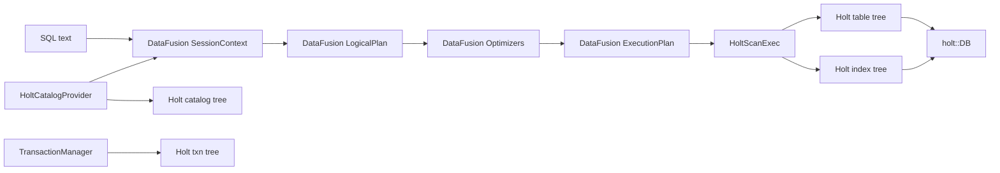
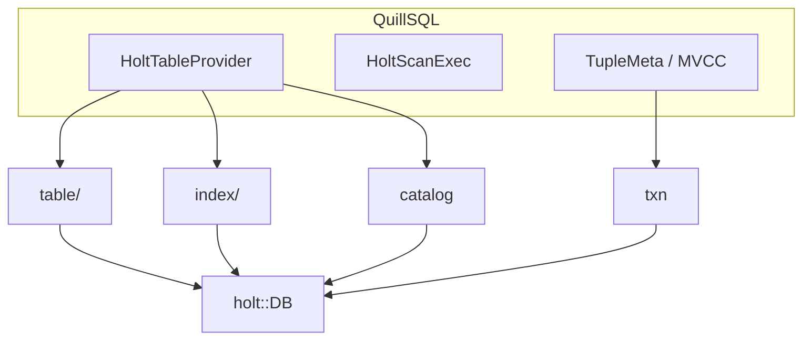

# QuillSQL Architecture

QuillSQL is a SQL research layer over Holt. DataFusion owns SQL parsing, binding,
logical optimization, physical optimization, and physical execution. QuillSQL owns the
Holt catalog/table/index adapter, MVCC metadata, transaction status recovery, and the
CLI/server surfaces.

## End-to-End Pipeline

```mermaid
flowchart LR
    SQL["SQL text"] --> DF["DataFusion SessionContext"]
    DF --> Logical["DataFusion LogicalPlan"]
    Logical --> Optimized["DataFusion Optimizers"]
    Optimized --> Physical["DataFusion ExecutionPlan"]
    Physical --> Scan["HoltScanExec"]
    Scan --> Table["Holt table tree"]
    Scan --> Index["Holt index tree"]
    Table --> Holt["holt::DB"]
    Index --> Holt

    Catalog["HoltCatalogProvider"] --> DF
    Catalog --> Descriptors["Holt catalog tree"]
    Txn["TransactionManager"] --> Status["Holt txn tree"]
```

DDL is the main place where QuillSQL intercepts DataFusion: `CREATE TABLE`,
`CREATE INDEX`, and `DROP TABLE` update Holt descriptors and refresh the in-memory
catalog projection. DML uses DataFusion table-provider hooks and writes through Holt.

## Storage Boundary

```mermaid
flowchart TD
    subgraph QuillSQL
        Provider["HoltTableProvider"]
        ScanExec["HoltScanExec"]
        TxnMeta["TupleMeta / MVCC"]
    end

    Provider --> RowTree["table/<table_id>"]
    Provider --> IndexTree["index/<index_id>"]
    Provider --> CatalogTree["catalog"]
    TxnMeta --> TxnTree["txn"]

    RowTree --> DB["holt::DB"]
    IndexTree --> DB
    CatalogTree --> DB
    TxnTree --> DB
```

There is no QuillSQL-owned page cache, heap file, B+Tree, storage scheduler, or
SQL-data WAL. Holt owns durable bytes and its own logging. QuillSQL decides SQL/MVCC
semantics and encodes row/index values into Holt trees.

## Important Invariants

- Holt descriptors are the durable source of truth for table ids, index ids, and schemas.
- DataFusion `information_schema` is generated from the Holt catalog provider.
- Row values are stored as encoded `TupleMeta + Tuple`.
- Index keys use order-preserving SQL encoding plus RID tie-breakers.
- Startup recovers transaction status from Holt before query execution.
- In-progress or unknown row versions are not visible as committed data.

## Query Compilation Boundary

The JIT research boundary is the DataFusion `ExecutionPlan` and Arrow `RecordBatch`
interface. The `jit-mlir` feature wires in an MLIR-named physical optimizer rule as the
extension point; native DataFusion execution remains the fallback for unsupported
expressions.
