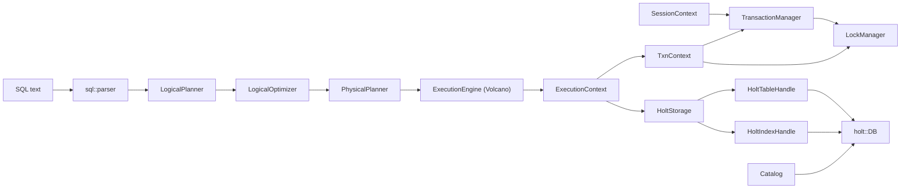
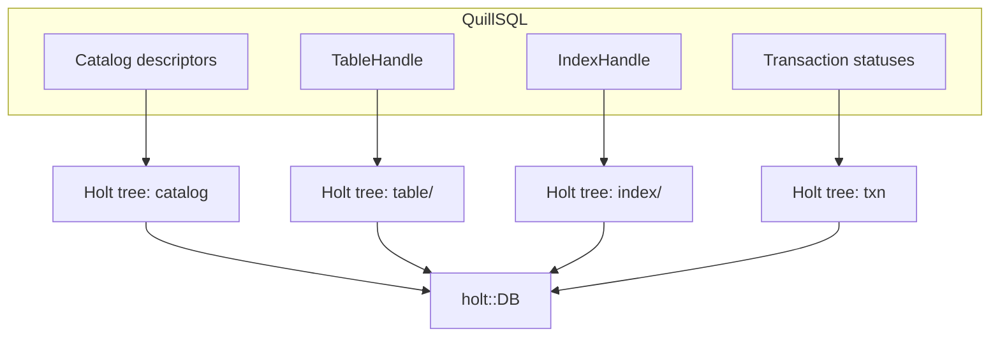

# QuillSQL Architecture

QuillSQL is now a SQL layer over Holt. The project owns parsing, logical planning,
optimization, Volcano execution, catalog projection, transaction state, MVCC visibility,
and lock management. Persistent rows, indexes, catalog descriptors, and recovered
transaction status live in `holt::DB`.

## End-to-End Pipeline


```mermaid
flowchart LR
    SQL["SQL text"] --> Parser["sql::parser"]
    Parser --> Logical["LogicalPlanner"]
    Logical --> Optimizer["LogicalOptimizer"]
    Optimizer --> Physical["PhysicalPlanner"]
    Physical --> Exec["ExecutionEngine (Volcano)"]

    Session["SessionContext"] --> Txn["TransactionManager"]
    Txn --> Locks["LockManager"]
    Exec --> Ctx["ExecutionContext"]
    Ctx --> TxnCtx["TxnContext"]
    TxnCtx --> Txn
    TxnCtx --> Locks

    Ctx --> Engine["HoltStorage"]
    Engine --> Table["HoltTableHandle"]
    Engine --> Index["HoltIndexHandle"]
    Table --> Holt["holt::DB"]
    Index --> Holt
    Catalog["Catalog"] --> Holt
```

The executor never touches Holt directly. It asks `ExecutionContext` for a
`TableBinding`, then uses object-safe table/index handles for scans and writes.

## Storage Boundary


```mermaid
flowchart TD
    subgraph QuillSQL
        Catalog["Catalog descriptors"]
        TableHandle["TableHandle"]
        IndexHandle["IndexHandle"]
        TxnStatus["Transaction statuses"]
    end

    Catalog --> HCatalog["Holt tree: catalog"]
    TableHandle --> HTable["Holt tree: table/<table_id>"]
    IndexHandle --> HIndex["Holt tree: index/<index_id>"]
    TxnStatus --> HTxn["Holt tree: txn"]

    HCatalog --> DB["holt::DB"]
    HTable --> DB
    HIndex --> DB
    HTxn --> DB
```

Holt is the only durable storage engine. QuillSQL no longer contains an internal page
heap, buffer pool, B+Tree, storage scheduler, or SQL-data WAL. This keeps the boundary
clear: QuillSQL decides SQL semantics; Holt owns durable bytes and its own logging.

## Important Invariants

- A table descriptor in Holt is the durable source of truth for a table id and schema.
- `information_schema` is a SQL-visible projection backed by Holt system tables.
- Row values are stored as encoded `TupleMeta + Tuple`.
- Index keys use order-preserving SQL encoding plus RID tie-breakers, so Holt byte order
  matches SQL range-scan order.
- Commit and rollback write final transaction status into Holt. Startup recovers those
  statuses before planning or executing statements.

## Execution Contract

`TableBinding` is the executor's storage facade:

```text
scan()
index_scan(name, range)
insert(txn, tuple)
delete(txn, rid, prev_meta, prev_tuple)
update(txn, rid, new_tuple, prev_meta, prev_tuple)
prepare_row_for_write(txn, rid, observed_meta)
```

Physical operators stay small because they only express SQL work: scan rows, evaluate
expressions, ask `TxnContext` for visibility/locks, and call the table binding for
mutations.

## Restart Behavior

On open, QuillSQL loads Holt catalog descriptors, reconstructs the in-memory catalog,
loads transaction statuses, and advances the next transaction id past recovered ids.
Unknown or in-progress row versions are not treated as committed by visibility checks.
