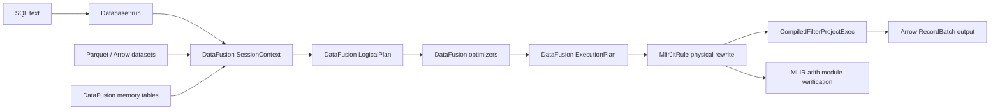

# QuillSQL Architecture

QuillSQL is a thin SQL research shell around DataFusion. It does not implement
its own parser, binder, optimizer, executor, page store, WAL, SQL catalog, or
index manager. The storage path is DataFusion-native: memory tables for local
experiments and Arrow/Parquet datasets for persistent analytical data.

## End-to-End Pipeline


```mermaid
flowchart LR
    SQL["SQL text"] --> DB["Database::run"]
    DB --> DF["DataFusion SessionContext"]
    DF --> Logical["DataFusion LogicalPlan"]
    Logical --> Optimized["DataFusion optimizers"]
    Optimized --> Physical["DataFusion ExecutionPlan"]
    Physical --> JITRule["MlirJitRule physical rewrite"]
    JITRule --> CompiledExec["CompiledFilterProjectExec"]
    CompiledExec --> Arrow["Arrow RecordBatch output"]

    Parquet["Parquet / Arrow datasets"] --> DF
    Memory["DataFusion memory tables"] --> DF
    JITRule --> MLIR["MLIR arith module verification"]
```

## Storage Boundary

There is no QuillSQL-owned storage engine after the cleanup.

- Temporary or interactive data uses DataFusion's in-memory tables.
- Durable data should be registered as Parquet/Arrow datasets.
- DataFusion's catalog and file-source integrations define table visibility.
- QuillSQL's `DatabaseOptions::data_dir` is scratch state, not a private database
  file format.

This makes the project better suited to OLAP/query-compiler research than OLTP
storage-engine research.

## JIT Boundary

The JIT boundary is the DataFusion physical plan plus Arrow `RecordBatch`
interface. `MlirJitRule` walks DataFusion physical plans and tries to lower
supported `FilterExec` and `ProjectionExec` expressions into a small JIT IR.

The MLIR backend then emits scalar `arith` functions and verifies them through
`melior` when `jit-mlir` is enabled. The physical optimizer can replace
filter/project islands with `CompiledFilterProjectExec`; the current executable
node runs a fixed-width Arrow batch kernel implemented in QuillSQL while carrying
the MLIR kernel descriptor. Native MLIR function pointers are the next step, so
unsupported expressions fall back to the normal DataFusion plan.

## IR And Fusion

QuillSQL keeps two JIT-level IRs:

- `KernelIR`: a single compilable kernel such as filter, projection, or fused
  filter/project.
- `PipelineIR`: a linear pipeline prefix from a DataFusion physical plan.

The first fusion pattern is deliberately small:

```text
Filter -> Projection
  => KernelIR::FilterProject
```

The rule also handles the common DataFusion shape where a round-robin
`RepartitionExec` sits between the filter and projection by placing the compiled
node below the repartition. This lets the project measure a real operator
boundary before taking on joins, aggregates, hash repartitioning, or whole-query
pipeline lowering.
