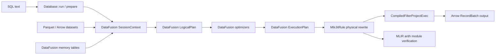

# QuillSQL Architecture

QuillSQL is a thin SQL research shell around DataFusion. It does not implement
its own parser, binder, optimizer, executor, page store, WAL, SQL catalog, or
index manager. The storage path is DataFusion-backed: memory tables for local
experiments and Arrow/Parquet datasets for persistent analytical data.

## End-to-End Pipeline


```mermaid
flowchart LR
    SQL["SQL text"] --> DB["Database::run / prepare"]
    DB --> DF["DataFusion SessionContext"]
    DF --> Logical["DataFusion LogicalPlan"]
    Logical --> Optimized["DataFusion optimizers"]
    Optimized --> Physical["DataFusion ExecutionPlan"]
    Physical --> JITRule["MlirJitRule physical rewrite"]
    JITRule --> CompiledExec["CompiledFilterProjectExec"]
    CompiledExec --> Arrow["Arrow RecordBatch output"]

    Parquet["Parquet / Arrow datasets"] --> DF
    Memory["DataFusion memory tables"] --> DF
    JITRule --> MLIR["MLIR arith module verification"]
```

## Storage Boundary

There is no QuillSQL-owned storage engine after the cleanup.

- Temporary or interactive data uses DataFusion's in-memory tables.
- Durable data should be registered as Parquet/Arrow datasets.
- DataFusion's catalog and file-source integrations define table visibility.
- QuillSQL's `DatabaseOptions::data_dir` is scratch state, not a private database
  file format.
- `DatabaseOptions::debug_trace` controls plan introspection. It is useful for
  interactive debugging, but benchmark paths disable it to avoid measuring
  trace-only planning work.

This makes the project better suited to OLAP/query-compiler research than OLTP
storage-engine research.

## JIT Boundary

The JIT boundary is the DataFusion physical plan plus Arrow `RecordBatch`
interface. `MlirJitRule` walks DataFusion physical plans and tries to lower
supported `FilterExec` and `ProjectionExec` expressions into a small JIT IR.

The MLIR backend then emits scalar `arith` functions and verifies them through
`melior` when `jit-mlir` is enabled. The physical optimizer can replace
filter/project islands with `CompiledFilterProjectExec`; the current executable
node runs a fixed-width Arrow batch kernel implemented in QuillSQL while carrying
the MLIR kernel descriptor. A narrow compiled `i64 -> bool` MLIR ExecutionEngine
probe validates scalar invocation. The compiled fixed-width path now has an
`i64` filter kernel that writes a byte selection mask, an `i64` filter/project
kernel that compacts one projected column, an `f64` filter/sum kernel for the
first plain-aggregate path, and a Q6-shaped `Date32`/`Decimal128` filter/sum
kernel over fixed-width column slices. `CompiledFilterProjectExec` can invoke
the i64 filter/project kernel, and `CompiledFilterSumExec` can invoke the
filter/sum kernels through thread-local MLIR execution caches when `jit-mlir` is
enabled, `JitOptions::mlir_execution()` is selected, and the input batch has no
nulls or slice offsets. CLI, server, and benchmark binaries map
`QUILL_JIT=mlir` to that option at startup. Unsupported expressions and unsafe
batch layouts fall back to the normal DataFusion plan or the fixed-width Arrow
runtime.

## IR And Fusion

QuillSQL keeps two JIT-level IRs:

- `KernelIR`: a single compilable kernel such as filter, projection, or fused
  filter/project.
- `PipelineIR`: a linear pipeline prefix from a DataFusion physical plan.

The first fusion patterns are deliberately small:

```text
Filter -> Projection
  => KernelIR::FilterProject

Filter -> SUM(f64 expression)
Filter(Date32/Decimal128 comparisons) -> SUM(Decimal128 * Decimal128)
  => CompiledFilterSumExec
```

The rule also handles the common DataFusion shape where a round-robin
`RepartitionExec` sits between the filter and projection by placing the compiled
node below the repartition. For plain aggregates, it rewrites the partial `SUM`
node to a partition-preserving compiled filter/sum node and leaves DataFusion's
final aggregate in place. This lets the project measure real operator
boundaries before taking on grouped aggregates, joins, hash repartitioning, or
whole-query pipeline lowering. The decimal path now has both a DataFusion-safe
fixed-width Arrow runtime specialization and an executable MLIR dispatch path
for the same fixed-width column layout.
