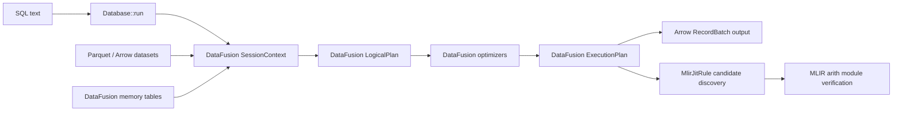

# QuillSQL Architecture

QuillSQL is a thin SQL research shell around DataFusion. It does not implement
its own parser, binder, optimizer, executor, page store, WAL, SQL catalog, or
index manager. The storage path is DataFusion-native: memory tables for local
experiments and Arrow/Parquet datasets for persistent analytical data.

## End-to-End Pipeline


```mermaid
flowchart LR
    SQL["SQL text"] --> DB["Database::run"]
    DB --> DF["DataFusion SessionContext"]
    DF --> Logical["DataFusion LogicalPlan"]
    Logical --> Optimized["DataFusion optimizers"]
    Optimized --> Physical["DataFusion ExecutionPlan"]
    Physical --> Arrow["Arrow RecordBatch output"]

    Parquet["Parquet / Arrow datasets"] --> DF
    Memory["DataFusion memory tables"] --> DF
    Physical --> JITRule["MlirJitRule candidate discovery"]
    JITRule --> MLIR["MLIR arith module verification"]
```

## Storage Boundary

There is no QuillSQL-owned storage engine after the cleanup.

- Temporary or interactive data uses DataFusion's in-memory tables.
- Durable data should be registered as Parquet/Arrow datasets.
- DataFusion's catalog and file-source integrations define table visibility.
- QuillSQL's `DatabaseOptions::data_dir` is scratch state, not a private database
  file format.

This makes the project better suited to OLAP/query-compiler research than OLTP
storage-engine research.

## JIT Boundary

The JIT boundary is the DataFusion physical plan plus Arrow `RecordBatch`
interface. `MlirJitRule` walks DataFusion physical plans and tries to lower
supported `FilterExec` and `ProjectionExec` expressions into a small JIT IR.

The MLIR backend then emits scalar `arith` functions and verifies them through
`melior` when `jit-mlir` is enabled. Native kernel execution is the next step;
the current rule is discovery and verification only, so unsupported expressions
fall back to DataFusion without a parallel executor.

## IR And Fusion

QuillSQL keeps two JIT-level IRs:

- `KernelIR`: a single compilable kernel such as filter, projection, or fused
  filter/project.
- `PipelineIR`: a linear pipeline prefix from a DataFusion physical plan.

The first fusion pattern is deliberately small:

```text
Filter -> Projection
  => KernelIR::FilterProject
```

This lets the project measure a real operator boundary before taking on joins,
aggregates, repartitioning, or whole-query pipeline lowering.
