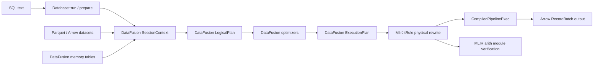

# QuillSQL Architecture

QuillSQL is a thin SQL research shell around DataFusion. It does not implement
its own parser, binder, optimizer, executor, page store, WAL, SQL catalog, or
index manager. The storage path is DataFusion-backed: memory tables for local
experiments and Arrow/Parquet datasets for persistent analytical data.

## End-to-End Pipeline


```mermaid
flowchart LR
    SQL["SQL text"] --> DB["Database::run / prepare"]
    DB --> DF["DataFusion SessionContext"]
    DF --> Logical["DataFusion LogicalPlan"]
    Logical --> Optimized["DataFusion optimizers"]
    Optimized --> Physical["DataFusion ExecutionPlan"]
    Physical --> JITRule["MlirJitRule physical rewrite"]
    JITRule --> CompiledExec["CompiledPipelineExec"]
    CompiledExec --> Arrow["Arrow RecordBatch output"]

    Parquet["Parquet / Arrow datasets"] --> DF
    Memory["DataFusion memory tables"] --> DF
    JITRule --> MLIR["MLIR arith module verification"]
```

## Storage Boundary

There is no QuillSQL-owned storage engine after the cleanup.

- Temporary or interactive data uses DataFusion's in-memory tables.
- Durable data should be registered as Parquet/Arrow datasets.
- DataFusion's catalog and file-source integrations define table visibility.
- QuillSQL's `DatabaseOptions::data_dir` is scratch state, not a private database
  file format.
- `DatabaseOptions::debug_trace` controls plan introspection. It is useful for
  interactive debugging, but benchmark paths disable it to avoid measuring
  trace-only planning work.

This makes the project better suited to OLAP/query-compiler research than OLTP
storage-engine research.

## JIT Boundary

The JIT boundary is the DataFusion physical plan plus Arrow `RecordBatch`
interface. `MlirJitRule` walks DataFusion physical plans, asks
`pipeline/extract.rs` to extract supported physical pipelines, and delegates
compilation to `lower/compiler.rs`.

The MLIR backend then emits scalar `arith` functions and verifies them through
`melior` when `jit-mlir` is enabled. The physical optimizer can replace
filter/project and plain `SUM` pipelines with `CompiledPipelineExec`; the current
executable node runs fixed-width Arrow pipeline kernels implemented in QuillSQL
while carrying the MLIR pipeline descriptor and a structured `PipelineSpec`. A narrow compiled
`i64 -> bool` MLIR ExecutionEngine
probe validates scalar invocation. The compiled fixed-width path now has an
`i64` filter kernel that writes a byte selection mask, an `i64` filter/project
kernel that compacts one projected column, an `f64` filter/sum kernel for the
first plain-aggregate path, and a Q6-shaped `Date32`/`Decimal128` filter/sum
kernel over fixed-width column slices. `CompiledPipelineExec` invokes the record
and scalar-sum kernels through thread-local MLIR execution caches when `jit-mlir` is
enabled, `JitOptions::mlir_execution()` is selected, and the input batch has no
nulls or slice offsets. The dispatch layer consumes `PipelineSpec`; it no longer
re-parses runtime expressions to guess input columns. CLI, server, and benchmark binaries map
`QUILL_JIT=mlir` to that option at startup. Unsupported expressions and unsafe
batch layouts fall back to the fixed-width Arrow runtime. Set `QUILL_JIT=off`
to keep a pure DataFusion physical plan for baseline measurements.

## IR And Fusion

QuillSQL keeps one semantic pipeline IR plus an explicit lowering boundary:

- `PipelineIR`: a linear pipeline prefix from a DataFusion physical plan,
  including the first `filter -> plain SUM` sink shape used as the stepping
  stone toward whole-pipeline lowering.
- `QuillDialectModule`: a textual custom-dialect model with explicit
  `quill.source`, `quill.exec`, and `quill.sink` operations. Covered pipeline
  specs lower through this dialect before executable MLIR is emitted.
- `PipelineLowering`: an exact pattern match from `PipelineIR` to an executable
  record or aggregate kernel shape.

The first fusion patterns are deliberately small:

```text
Filter -> Projection
  => PipelineLowering::Record

Filter -> SUM(f64 expression)
Filter(Date32/Decimal128 comparisons) -> SUM(Decimal128 * Decimal128)
  => CompiledPipelineExec(kind=aggregate, sink=scalar_sum)
```

`pipeline/extract.rs` also recognizes the common DataFusion shape where a
round-robin `RepartitionExec` sits between the filter and projection, and
records that as an output adapter on the extracted pipeline. For plain
aggregates, it extracts the partial `SUM` pipeline and leaves DataFusion's final
aggregate in place. `pipeline/rule.rs` only performs traversal and replacement;
it no longer constructs shape-specific execution nodes directly. The recognized
physical-plan shapes are also exposed as `PipelineIR` candidates in debug traces,
so future
whole-pipeline lowering does not rely on string plan inspection. This lets the
project measure real operator boundaries before taking on grouped aggregates,
joins, hash repartitioning, or whole-query pipeline lowering. The decimal path
now has both a DataFusion-safe fixed-width Arrow runtime specialization and an
executable MLIR dispatch path for the same fixed-width column layout, using the
same Q6-shaped decimal `PipelineSpec`. That decimal path is now the first
executable Quill dialect lowering path rather than another runtime-only
specialized emitter.

The intended compiler path is:

```text
DataFusion ExecutionPlan
  -> PipelineIR
  -> Quill dialect
  -> lowering to scf/arith/llvm
  -> ExecutionEngine kernel
```

The current executable compiled kernels now share that route for the covered
fixed-width cases: single-column `i64 filter/project`, `f64 filter/sum`, and the
Q6-shaped decimal `filter -> plain SUM` path. The remaining work is broadening
the dialect operations and lowering rules rather than adding more direct runtime
shortcuts.
