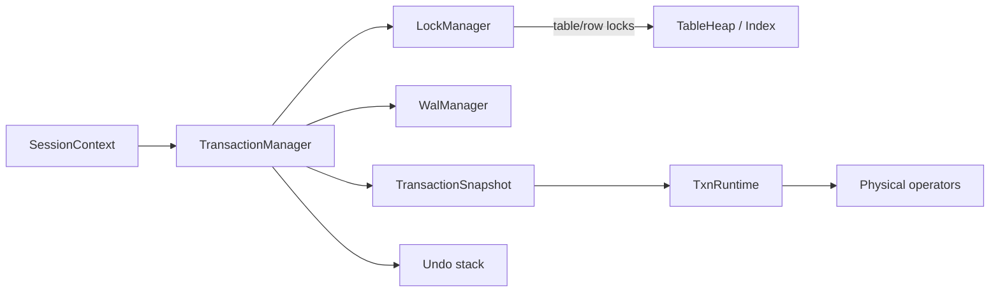
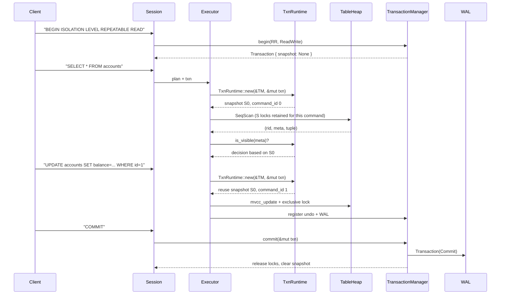
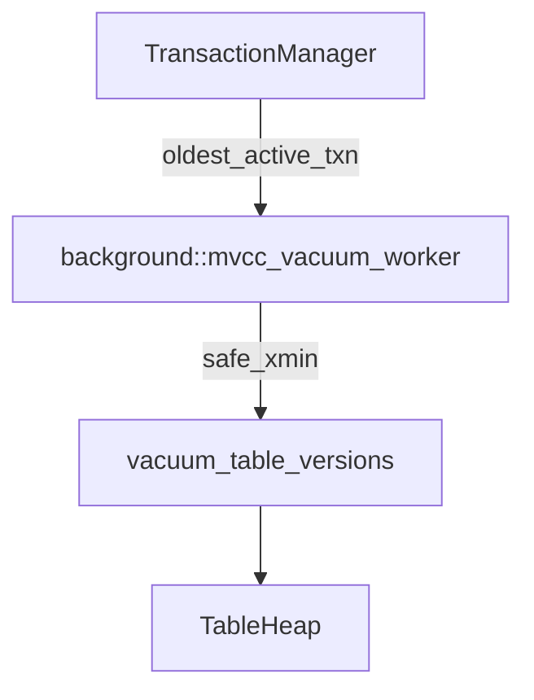

# Transactions, Concurrency & MVCC

This guide dives into QuillSQL’s transaction subsystem, how MVCC snapshots are produced and consumed, and the supporting background processes that keep old versions in check. Diagrams are provided using Mermaid for easy rendering.

---

## 1. Module Overview

- **`SessionContext` (`src/session/mod.rs`)**  
  Manages per-connection defaults (isolation, access mode, autocommit) and the active `Transaction`. Handles `SET TRANSACTION`/`SET SESSION TRANSACTION`, ensuring new transactions inherit the desired modes.

- **`Transaction` (`src/transaction/transaction.rs`)**  
  Stores the transaction id, isolation/access mode, state, WAL LSNs, undo actions, command counters, and—starting with this release—a cached MVCC snapshot used for Repeatable Read / Serializable.

- **`TransactionManager`**  
  Entry point for `begin`, `commit`, and `abort`. Assigns IDs, writes WAL begin/commit/abort records, maintains active transaction sets, and provides helper methods for acquiring table/row locks. Produces `TransactionSnapshot` objects that encode `xmin`, `xmax`, and the active transaction list for visibility decisions.

- **`TxnRuntime` (`src/transaction/runtime.rs`)**  
  Lightweight wrapper handed to physical operators. Each command increments the transaction’s command id, selects (or reuses) the appropriate snapshot based on isolation level, and exposes helpers for row/table locks plus visibility checks.

- **`LockManager`**  
  Central 2PL engine with multi-granularity modes (IS/IX/S/SIX/X), FIFO wait queues, and deadlock detection via a wait-for graph. Shared row locks are released eagerly for RC, retained within the command for RR, and held to commit for Serializable.

- **Undo Stack**  
  DML operators push logical undo entries so abort/rollback can restore heap pages and remove secondary index entries. Abort writes CLRs and replays undo actions.

- **Background MVCC Vacuum**  
  `background::spawn_mvcc_vacuum_worker` computes `safe_xmin` from the transaction manager’s oldest active id and reclaims tuple versions deleted by committed transactions or inserted by aborted ones once no running transaction can see them.

---

## 2. Snapshot Semantics

| Isolation Level | Snapshot Lifetime | Lock Behavior | Notes |
| ----------------| ----------------- | ------------- | ----- |
| Read Uncommitted | Fresh snapshot per command | No shared row locks | May see dirty reads; used mainly for diagnostics. |
| Read Committed | Fresh snapshot per command | Shared locks acquired then released immediately | Prevents dirty reads; each statement sees the latest committed data. |
| Repeatable Read | Snapshot cached at first command and reused | Shared locks kept for the duration of the command, then released | Provides statement-consistent reads. MVCC ensures previously read rows remain stable across statements. |
| Serializable | Same cached snapshot as RR | Shared locks retained until commit (strict 2PL) | Today equivalent to locking-based serializable. Future work: SSI / predicate locking. |

- `Transaction::set_snapshot` caches the snapshot for RR/SR; `clear_snapshot` is invoked when the isolation level drops to RC/RU or at commit/abort.
- `TransactionSnapshot::is_visible` inspects tuple metadata (`insert_txn_id`, `delete_txn_id`, `CommandId`) to decide whether the tuple should be visible for the current command, accounting for aborted transactions, active transactions, and self-modifications.

---

## 3. Statement Execution Timeline

Key behaviors:
- UPDATE skips tuple versions created by the same `(txn_id, command_id)` to avoid chasing its own MVCC chain.
- If another transaction commits in between the two statements, its new version remains invisible to the RR transaction thanks to the cached snapshot.
- Shared locks used to verify visibility are released at the end of each command in RR, while Serializable holds them longer to ensure strict 2PL.

---

## 4. Background MVCC Vacuum

Algorithm sketch:
1. Compute `safe_xmin = oldest_active_txn() or next_txn_id_hint()`.
2. For each registered table (excluding information_schema), iterate tuples in batches.
3. If a tuple is marked deleted and `delete_txn_id < safe_xmin`, reclaim it.
4. If a tuple was inserted by an aborted txn with `insert_txn_id < safe_xmin`, reclaim it.
5. Stop after `batch_limit` tuples per run.

This keeps heap pages compact over time without blocking foreground work.

---

## 5. Integration with WAL & Recovery

- `TransactionManager::begin/commit/abort` append WAL records. Commit optionally waits for durability based on `synchronous_commit`.
- Aborts walk the undo stack, emit CLRs, and replay inverse heap/index changes.
- Recovery follows ARIES (analysis → redo → undo). CLRs make undo idempotent in case a crash happens during recovery.
- Buffer manager tracks dirty pages and recLSNs; checkpoints capture the ATT + DPT so redo can start near the earliest outstanding change.

---

## 6. Testing & Diagnostics

- Unit tests in `src/tests/transaction_tests.rs` cover:
  - Read-only enforcement (`read_only_transaction_rejects_dml`).
  - Read Committed self-update (`read_committed_allows_update_after_select`).
  - Lock blocking (`repeatable_read_blocks_update_until_commit`).
  - Snapshot isolation (`repeatable_read_sees_consistent_snapshot_after_update`).
- Use `RUST_LOG=trace` to surface lock grants, wait edges, and deadlock warnings.
- `TransactionManager::active_transactions()` and `oldest_active_txn()` help debugging vacuum decisions.

---

## 7. Future Work

- Predicate / next-key locking to prevent phantoms under Serializable.
- Expose transaction statistics (wait time, undo size) via system tables.
- Smarter vacuum scheduling based on table size and churn.
- Serializable Snapshot Isolation (SSI) to reduce locking while ensuring serializability.

The current system already mirrors industrial designs: MVCC + 2PL, ARIES-style WAL, cached snapshots for higher isolation levels, and background vacuuming. These docs should help both contributors and students trace how a transaction traverses the stack and where to hook in new behavior.
